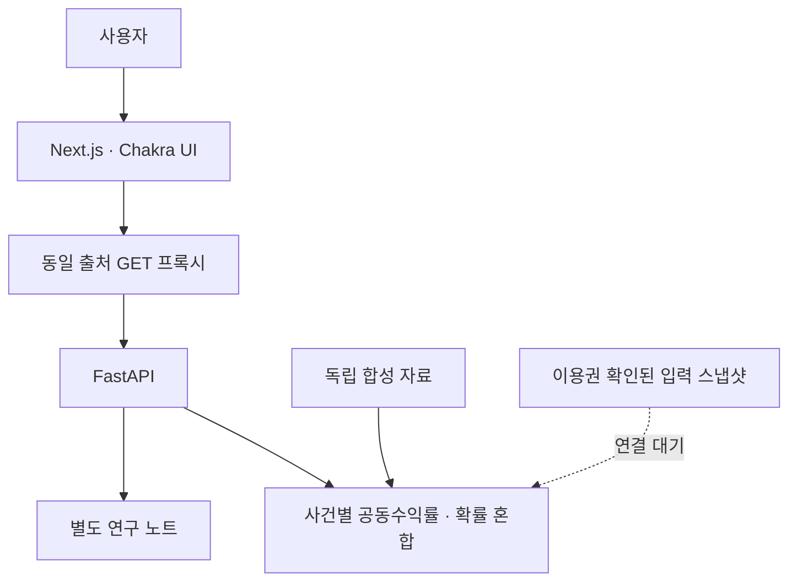

# ShockGraph AI: 거시경제 이벤트 기반 자산 리스크 분석 시스템

시장 내재확률과 과거 CPI 사건의 자산 공동수익률을 결합하는 포트폴리오 리스크 시뮬레이터다.
사용자가 SPY·TLT 비중과 선택적 USD 평가액을 입력하면 발표 후 5분·30분의 평균 변화,
상승·하락·보합 추정확률과 P10–P90 범위를 계산한다. 예측 성능이나 수익 보장을 뜻하지 않는다.

## 현재 제품과 데이터 상태

포트폴리오 결과 중심 화면을 구현했으며, FOMC·EIA 원유재고·유가는 후속 확장 대상이다.
[실행 전략](docs/portfolio-event-expansion-strategy.md)에 순서·계산 방법·완료 기준을 정리했다.
[구현 리뷰](docs/reviews/portfolio-risk-simulator-review.md)에 검증 범위와 사용자 점검표가 있다.

- `/`: SPY 비중 입력·나머지 TLT 비중, 선택적 평가액, 포트폴리오 평균 변화·상승/하락/보합 확률·
  혼합분포 분위수·자산 평균 기여. 시나리오별 확률과 표본은 펼치는 근거 영역에 둔다.
- `/methodology`: Brier·CRPS의 기존 검증 기록과 해석 한계. 메인 화면의 주 지표와 분리했다.
- 데모는 독립적으로 만든 합성 사건 36건과 합성 호가로 API가 실제 계산한다.
  데모 확률·수익률은 금융 성과나 실측 자료가 아니다.
- 실제 화면은 `SHOCKGRAPH_SCENARIO_DATASET`의 검증된 입력이 있어야 수치를 표시한다.
  현재 연결된 기존 집계만으로는 시나리오별 분위수를 복원할 수 없어 연결 대기 상태다.
  실제 데이터가 없거나 검증에 실패하면 데모로 대체하지 않는다.
- 조회 요청은 웹의 상대 경로 `/api`를 사용한다. Next.js 서버가 허용된 GET 경로만
  FastAPI에 전달해 환경별 API 주소를 브라우저에서 분리한다.
- 첫 공개 대상은 합성 데모다. 실제 자료의 연구·공개·상업 이용권은 별도로 확인한다.
  자동 주문·개인화된 매수·매도 권유·로그인 기반 포트폴리오 저장은 구현하지 않았다.
- `GET /v1/portfolios/cpi`: 비중 합 1, 지원 구간, 자료 모드를 검증한다. 실제 자료가 없으면
  `pending`, 양의 확률을 가진 시나리오의 표본이 부족하면 `insufficient_data`와 `result=null`이다.

## 빠른 실행

가상환경과 의존성 설치 후, 두 터미널에서 실행한다.

```bash
make PYTHON=.venv/bin/python api-demo
npm --prefix apps/web ci
npm --prefix apps/web run dev
```

Windows PowerShell에서는 첫 터미널에서 다음 명령을 사용한다.

```powershell
$env:SHOCKGRAPH_SERVICE_MODE="demo"
.\.venv\Scripts\python -m uvicorn shockgraph_api.app:app --host 127.0.0.1 --port 8000
```

웹은 `http://localhost:3000`, API 문서는 `http://localhost:8000/docs`다.
개발 웹의 기본 API 주소는 `http://127.0.0.1:8000`이며, 배포 웹은 서버 환경변수
`SHOCKGRAPH_API_URL`에 API의 원점 주소를 설정해야 한다. 비밀키가 필요하지 않다.

Docker가 있는 환경에서는 `docker compose -f compose.demo.yml up --build -d`로
API·웹·Nginx를 함께 실행하고 `http://localhost:8080`에서 확인한다.
클라우드 설정과 완료 기준은 [데모 배포 안내](docs/scenario-demo-deployment.md)에 있다.

## 제품의 현재 아키텍처



서비스 조회는 검증된 스냅샷과 합성 자료를 사용하며 수집·학습을 요청마다 실행하지 않는다.
포트폴리오 조회는 적재된 사건의 공동수익률로 요청 비중을 계산하며 외부 수집·학습을 실행하지 않는다.
현재 조회 경로는 DB 없이 작동한다. 기존 PostgreSQL 스키마는 수집 및 후속 영속화 설계이며,
현재 서비스의 실제 DB 연결이나 무중단 운영을 구현한 것으로 주장하지 않는다.

## 통계 검증의 현재 결론

기존 기록의 CPI `MoM > 0.3%` 24개 비교 사건에서 Brier는 시장확률 0.1005,
과거 빈도 0.2342였다. 이는 단순 과거 빈도 대비 결과이며 자산 예측력의 근거가 아니다.
ETF 비교는 엄격한 조건에서 평균 오차가 늘었고, 거래량 조건을 완화한 F3의 시험 16건에서는
네 조합 모두 평균 오차가 줄었지만 모든 95% 구간이 0을 포함했다.
**Kalshi의 자산 예측 추가 효과는 아직 입증되지 않았다.**

[예측 가치 재평가](docs/reviews/prediction-value-reassessment-review.md),
[시나리오 제품 전환 리뷰](docs/reviews/scenario-risk-product-review.md),
[포트폴리오 설명](docs/portfolio-story.md)을 확인한다.

## 현재 구현 상태

1~35일차 작업에서 데이터 계약, 발표 단위 기준 모델 비교, Kalshi CPI 실데이터 감사,
BLS 최초 발표 빈티지 검증, 미국 ETF 분봉 수집과 다중 임계값 CPI 분포 계층까지 구현했다.

- API, 웹, 수집기, 분석 패키지, 인프라의 저장소 구조
- Kalshi API 계약 검증용 고정 응답 자료
- 응답 정규화와 원본 해시 계산
- 이벤트 단위 분할과 시각 기반 미래 정보 누수 방지
- 읽기 전용 공개 API의 기술적 가용성 확인 스크립트
- 진행 가능·범위 축소·보류 판단 문서
- UTC를 강제하는 이벤트, 시장 관측, 호가창 데이터 계약
- 원본 추적 제약조건을 갖춘 PostgreSQL 수집 스키마
- 재시도 횟수 제한과 커서 페이지네이션을 갖춘 GET 전용 공개 수집기
- 내용 기반 불변 원본 저장
- S3 호환 객체 키·저장 프로토콜과 불변 로컬 어댑터
- 큐·저장소 인터페이스와 원본 정규화 작업의 멱등 키
- TimescaleDB용 자산 가격·특징량 스키마와 트랜잭션 아웃박스 스키마
- UTC에서 미국·한국 거래소 현지 날짜로의 변환과 기준시점 정렬
- 이벤트별 시간순 확률 보정 데이터 분할
- 시장확률을 그대로 사용하는 기준 모델과 Brier 점수·표본 수·불확실성 계산
- 모델 산출물·체크섬·버전·평가 지표 등록 계약

- 발표 전 확률·기대·가격의 시점 검증과 이벤트별 커버리지·제외 사유
- 과거 수익률 분포와 이벤트 확률 가중 분포의 순차 학습·평가
- 자산·포트폴리오 CRPS, 상승확률 Brier, 하방 분위수 손실, 발표 단위 대응 재표집
- 정규화 입력과 결과 체크섬을 포함한 재현 리포트 CLI 및 합성 실행 예제
- Kalshi 공식 호환 운영 URL을 이용한 현재·과거 KXCPI 1분 캔들 수집
- 결과 확정 `T0.3` 55개 사건의 유동성·신선도 감사와 29개 유효 확률 확인
- 한 CPI 사건의 전체 방향성 임계값 호가 수집, 단조 투영과 배타적 확률구간 생성
- 정확한 인접 계약이 있을 때만 컨센서스 하회·부합·상회 확률을 계산하는 누수 방지 계약
- 24개 동일 사건에서 원시 시장확률과 누적 과거비율의 시간순 Brier 비교
- 논문용 사건 자료 CSV와 계보 메타데이터의 내용 해시 기반 내보내기
- BLS 공식 보도자료 아카이브의 최초 발표값·발표시각 수집과 원본 해시 보존
- Kalshi 55건 중 표준 월간 CPI 발표 53건의 결과 일치 검증과 비표준 2건 제외
- SPY·TLT·GLD 장전 분봉의 시각·OHLC·가용시각·완전성 품질 게이트
- 확률·최초 발표·세 ETF 5분·30분 수익률의 공통 사건 패널 생성기
- Alpaca Historical Bars의 GET 전용 수집, 재시도·페이지네이션과 원본 불변 저장
- 1분봉 시작시각을 종료·가용시각으로 정규화해 사건창의 1분 오차 방지
- BLS 발표별 최소 가격구간 수집과 IEX·SIP 피드 분리, 공통 표본 커버리지 보고

Kalshi 정산확률과 BLS 최초 발표의 대조와 GitHub Actions의 Alpaca SIP 수집을 완료했다.
2026-09-30 실행에서 실제 장전 분봉 5,051건, SPY·TLT 두 구간과 유효 확률이 겹치는
초기 공통 사건 27건을 확인했으며 발표 전 호가 시각을 수정한 엄격한 비교의 최종 공통
사건은 24건이다. 이후 필터 완화 후보는 최대 40건이며 같은 시험 집합이 아니다.
새 자산 비교기는 같은 조건부 분포 추정 방식에서 과거
발생비율과 Kalshi 확률만 교체해 평가한다. 전통 거시 기대·금리 변수를 넣은 모델과의
비교는 아직 미완료다. 원시 시장자료는 공개 저장소에 올리지 않는다.
FastAPI와 Next.js·Chakra UI 조회 화면은 연결했으며, 실제 데이터베이스 연결은 아직 없다.

현재 작업 결과는 [미국 ETF 분봉 수집 리뷰](docs/reviews/day-17-18-review.md),
다음 단계는 [가격 기준선 평가 리뷰](docs/reviews/day-19-20-review.md),
배포 API 단계는 [검증 결과 조회 API 리뷰](docs/reviews/day-21-release-review.md),
접근 문제는 [Alpaca API 트러블슈팅](docs/troubleshooting/alpaca-api-access.md),
재접속 후 상태는 [연동·재검증 기록](docs/reviews/analytics-sync-checkpoint.md), 목표 구조는
[아키텍처 문서](docs/architecture.md), 최근 분포 계층은
[다중 임계값·컨센서스 리뷰](docs/reviews/day-34-35-review.md)에서 확인할 수 있다.
최신 구현은 [CPI 사건별 확률곡선 커버리지 감사](docs/reviews/kalshi-cpi-history-coverage-review.md)다.
새 리뷰 파일명은 개발 일차 대신 핵심 기능을 사용한다.

2026-10-06 공식 이용조건 점검 후 실제 Kalshi 자료의 추가 수집·분석은 이용 허가
확인 전까지 보류한다. 과거 실측 기록은 이번 실행 결과가 아니다.
[접근과 이용 허가의 차이](docs/troubleshooting/kalshi-data-use-authorization.md)를 확인한다.

## 학습과 제품 설계

- [이벤트 분석 파이프라인 학습 가이드](docs/study-guide-analytics.md): 실행 방법, 시간 누수, 경험적 분포, CRPS, 지속 학습과의 연결
- [이번 CPI·ETF 커버리지 점검](docs/cpi-coverage-review.md): CPI 확률 실데이터와 ETF 연결 조건
- [논문 연구 패키지](docs/paper/README.md): 연구 프로토콜, 데이터 사전, 분석 계획, 논문 구성과 선행연구
- [데이터 파이프라인·확률 평가 학습 가이드](docs/study-guide-day-03-04.md): 6회 학습 순서, 코드 읽기, 실습, 금융 예제, 구현 한계
- [제품·Chakra UI 화면 설계](docs/product-ui-direction.md): 사용자 종목 선택, 이벤트 분석, 모바일 화면, 결과 표시 기준

설정 파일의 자산 목록은 분석 후보이며 학습 완료 목록이 아니다.
사용자는 지원되는 자산·이벤트·기간 조합에서 선택한다. 현재 화면의 주 분석은 CPI와
SPY·TLT, 발표 후 5분·30분이다. `SHOCKGRAPH_ABLATION_REPORT`를 연결하면 과거 평가의
표본 수·CRPS 차이·탐색적 불확실성을 표시하며, 연구 기준 20건 학습·시험 10건의 상태를
진단 기준 5건 학습과 구분한다. 곡률·DNN 연구는 배포 이후로 둔다.

## 로컬 실행

Python 3.12가 필요하다. 아래는 Windows 기준 명령어다.

```bash
python -m venv .venv
.venv/Scripts/python -m pip install -e ".[dev]"
.venv/Scripts/python -m pytest
```

macOS와 Linux에서는 `.venv/bin/python`을 사용한다.

가상환경의 Python으로 합성 이벤트 분석을 실행할 수 있다.

```bash
python scripts/run_event_research.py --input data/fixtures/analytics/synthetic_cpi.json --min-train 4
```

결과는 `artifacts/event-research/`에 저장되며 합성 결과는 금융 성능 근거가 아니다.

API와 비밀키 없이 사건별 누락·단조 보정·컨센서스 경계를 점검하려면 실행한다.

```bash
make research-cpi-curve-history-demo
```

이는 독립적으로 만든 합성 자료이며 예측 성능이나 실제 확보 표본 수를 입증하지 않는다.
GitHub push는 품질 검사·테스트·합성 감사만 실행한다. 실제 수집 작업은 수동 실행과
제공자 이용 허가 확인을 모두 요구한다.

실제 연구 이용 허가를 확보한 이후 한 CPI 사건의 확률곡선을 수집하는 명령은 다음과 같다.

```bash
make research-audit-cpi-curve \
  CPI_EVENT=KXCPI-26AUG \
  CPI_AS_OF=2026-09-11T12:25:00Z
```

결과는 `artifacts/kalshi-cpi-curves/`에 내용 해시별로 저장된다. 이는 CPI 분포 품질
감사이며 아직 전문가 컨센서스나 ETF 수익률 예측을 실행하는 명령은 아니다.

검증된 연구 메타데이터로 API와 웹 화면을 각각 실행한다.

```bash
SHOCKGRAPH_RESEARCH_METADATA=artifacts/paper-dataset/<실행 ID>/metadata.json make api-dev
make web-dev
```

웹 화면은 `http://localhost:3000`, API 문서는 `http://localhost:8000/docs`에서 확인한다.

## 저장소 구성

- `apps/api`: 검증된 연구 스냅샷을 제공하는 FastAPI 영역
- `apps/web`: Next.js·Chakra UI 기반 분석 조회 화면
- `apps/collector`: 읽기 전용 수집 영역
- `packages/domain`: 금융 데이터·포트폴리오 계약
- `packages/data_pipeline`: 원본 계약, 객체 저장, 멱등 정규화, 계보 추적, 거래시각 정렬, 누수 방지
- `packages/calibration`: 이벤트별 데이터셋과 시장확률 기준 모델·Brier 평가
- `packages/*`: 후속 이벤트 연구, 전이 분석, 위험 계산 영역
- `docs/data-feasibility.md`: 1일차 데이터 가용성 검토와 범위 결정
- `docs/data-source-gate-b.md`: 미국 자산·환율·국내 자산 공급원 검토
- `docs/architecture.md`: 원본 우선 수집과 데이터·모델·서빙 계층의 목표 구조
- `data/fixtures`: 원본 응답 형태를 따른 소규모 고정 테스트 자료
- `docs/reviews`: 요청별 변경 구조와 사용자 점검표

## 작업 규칙

문서는 한글로 작성하고, 커밋 제목에는 일차 대신 주요 변경 내용을 적는다.
상세 규칙은 [AGENTS.md](AGENTS.md)를 따른다.

공개 읽기 전용 엔드포인트나 데모 환경만 사용한다.
비밀키, 계정 데이터, 주문·거래 실행은 MVP 범위 밖이다.
