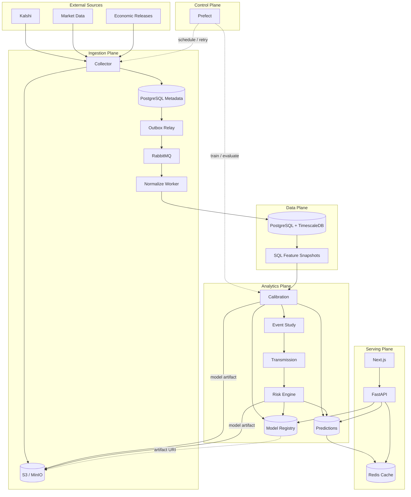

# ShockGraph AI Architecture

상태: Target architecture, not fully implemented
개정일: 2026-09-19

## 목적

이 문서는 ShockGraph AI의 데이터 수집, 저장, 모델 학습, API 서빙 경계를 정의한다.
현재 구현 상태는 [Day 1-2 리뷰](reviews/day-01-02-review.md), 제품 범위는
[프로젝트 기획서](../shockgraph-ai-project-spec.md)를 기준으로 판단한다.

## 아키텍처 원칙

1. 원본을 먼저 저장하고, 그 이후 처리 단계는 원본에서 재현할 수 있어야 한다.
2. 메시지는 중복 전달될 수 있으므로 모든 consumer는 멱등이어야 한다.
3. Orchestrator는 작업을 제어하지만 데이터 payload의 전달 경로가 아니다.
4. Redis와 Feature Store는 원본 데이터의 source of truth가 아니다.
5. 모델 binary와 대용량 snapshot은 Object Store, 관계형 metadata는 PostgreSQL에 둔다.
6. 시계열과 관계형 데이터는 PostgreSQL + TimescaleDB로 시작한다.
7. 웹은 FastAPI만 호출하며 DB와 cache에 직접 연결하지 않는다.

## 목표 구조

## 핵심 흐름

### Ingestion

`API -> Collector -> immutable object -> metadata/outbox -> RabbitMQ -> normalize -> TimescaleDB`

- Object write 성공 전에는 downstream 작업을 발행하지 않는다.
- Metadata와 outbox row는 하나의 PostgreSQL transaction으로 기록한다.
- Normalizer는 payload hash와 변환 버전으로 중복 처리를 방지한다.
- 실패 메시지는 재시도 횟수와 오류를 기록하고 dead-letter 정책으로 분리한다.

### Training

`Prefect -> as-of dataset -> calibration/event study -> evaluation -> registry`

- 학습 데이터는 event 단위 chronological split을 사용한다.
- `feature_as_of <= observed_at < resolved_at` 조건을 강제한다.
- 모델 binary는 Object Store에 저장하고 DB에는 URI와 checksum을 기록한다.
- 검증 기준을 통과하지 못한 모델은 serving 상태로 승격하지 않는다.

### Serving

`Next.js -> FastAPI -> Redis -> prediction/model metadata DB`

- Cache miss에서만 PostgreSQL을 조회하는 cache-aside 방식을 사용한다.
- 학습은 API request path에서 실행하지 않는다.
- 사용자 포트폴리오 요청은 입력 비중을 검증한 뒤 risk engine 결과만 반환한다.

## 물리 구성 선택

| 논리 계층 | MVP 선택 | 도입 시점 |
|---|---|---|
| Raw/Object Store | 현재 local FS, 이후 MinIO/S3 | protocol은 Day 3-4 |
| Message Broker | RabbitMQ | outbox 이후 |
| Metadata DB | PostgreSQL | 현재 schema 존재 |
| Time-series DB | TimescaleDB extension | Day 3-4 schema |
| Feature Store | SQL snapshot tables/views | Day 3-4 |
| Orchestrator | Prefect | ingestion vertical slice 이후 |
| Model Registry | PostgreSQL metadata + MinIO artifact | Day 3-4 contract |
| Cache | Redis | FastAPI 부하 측정 이후 |
| API / UI | FastAPI / Next.js | 분석 수직 슬라이스 이후 |

## 신뢰성 계약

- Delivery semantics: at-least-once를 가정한다.
- Idempotency key: `payload_hash + transformation_version + target_table`.
- Event time: source timestamp와 ingestion timestamp를 분리하고 UTC로 저장한다.
- Lineage: prediction에서 feature snapshot, model version, raw hash까지 역추적한다.
- Cache: TTL을 사용하며 invalidation 실패 시에도 DB 결과가 정답이다.
- Recovery: Object Store 원본에서 clean/feature/prediction을 재구축할 수 있어야 한다.

## 채택하지 않는 구성

- Kafka: 현재 처리량과 운영 규모에 비해 복잡도가 크고 Raw Store가 replay source다.
- 별도 Feature Store 제품: SQL snapshot으로 online/offline 일관성을 먼저 검증한다.
- 별도 시계열 DB cluster: TimescaleDB로 PostgreSQL 운영 경계를 유지한다.
- Kubernetes: 로컬·공모전 MVP의 검증 범위를 벗어난다.
- 서비스별 repository: 하나의 modular repository와 분리 실행 가능한 worker를 유지한다.

## 사용자 점검 항목

- [ ] RabbitMQ를 Kafka 대신 비동기 작업 broker로 사용하는 데 동의하는가?
- [ ] 로컬 개발은 MinIO, 운영은 S3-compatible storage를 사용하는가?
- [ ] 시계열 데이터와 metadata를 한 PostgreSQL/TimescaleDB 계열로 운영하는가?
- [ ] Feature Store 제품 도입을 온라인 추론 요구가 생길 때까지 보류하는가?
- [ ] Redis 도입을 FastAPI 성능 측정 이후로 미루는가?
- [ ] 모델 binary는 Object Store, 모델 version/metric은 PostgreSQL에 저장하는가?
- [ ] Day 3-4에서는 protocol/schema/baseline까지만 구현하고 전체 인프라 실행은 후속으로 두는가?

## 참고 문서

- [TimescaleDB hypertables](https://docs.timescale.com/use-timescale/latest/hypertables/)
- [Prefect flows](https://docs.prefect.io/latest/tutorial/flows)
- [RabbitMQ reliability](https://www.rabbitmq.com/docs/reliability)
- [MinIO S3-compatible storage](https://min.io/docs/minio/linux/index.html)
- [Redis client-side caching](https://redis.io/docs/latest/develop/clients/client-side-caching/)
