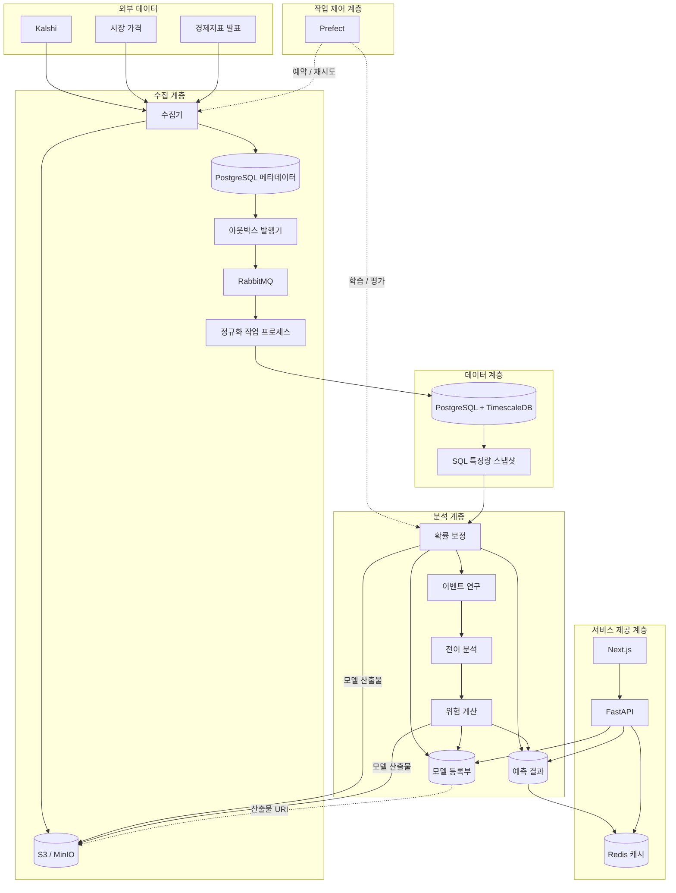

# ShockGraph AI 아키텍처

상태: 목표 구조이며 전체 구현은 완료되지 않음
개정일: 2026-09-22

## 목적

데이터 수집, 저장, 모델 학습, API 제공 영역을 정의한다.
현재 구현 상태는 [데이터·확률 평가 개발 리뷰](reviews/day-03-04-review.md),
제품 범위는 [프로젝트 기획서](../shockgraph-ai-project-spec.md)를 기준으로 판단한다.

## 아키텍처 원칙

1. 원본을 먼저 저장하고 이후 단계를 원본에서 재현할 수 있어야 한다.
2. 메시지가 중복 전달될 수 있으므로 모든 소비자는 멱등이어야 한다.
3. 작업 조율기는 작업을 제어하지만 데이터 본문의 전달 경로는 아니다.
4. Redis와 특징량 저장소는 원본 데이터의 기준 저장소가 아니다.
5. 모델 바이너리와 대용량 스냅샷은 객체 저장소에, 관계형 메타데이터는 PostgreSQL에 둔다.
6. 시계열과 관계형 데이터는 PostgreSQL과 TimescaleDB로 시작한다.
7. 웹은 FastAPI만 호출하며 DB와 캐시에 직접 연결하지 않는다.
8. MVP 배포는 로컬·Docker에서 검증하고, 상용 전환은 관리형 컨테이너에서 시작한다.

## 목표 구조

## 핵심 흐름

### 수집

API → 수집기 → 불변 객체 → 메타데이터·아웃박스 → RabbitMQ → 정규화 → TimescaleDB

- 객체 쓰기가 성공하기 전에는 후속 작업을 발행하지 않는다.
- 메타데이터와 아웃박스 행은 하나의 PostgreSQL 트랜잭션으로 기록한다.
- 정규화기는 원본 해시와 변환 버전으로 중복 처리를 방지한다.
- 실패 메시지의 재시도 횟수와 오류를 기록하고 별도 실패 메시지 처리 정책으로 분리한다.

### 학습

Prefect → 기준시점 데이터셋 → 확률 보정·이벤트 연구 → 평가 → 모델 등록부

- 이벤트 단위 시간순 분할을 사용한다.
- `feature_as_of <= observed_at < resolved_at` 조건을 강제한다.
- 모델 바이너리는 객체 저장소에 저장하고 DB에는 URI와 체크섬을 기록한다.
- 검증 기준을 통과하지 못한 모델은 서비스 제공 상태로 승격하지 않는다.

### 결과 제공

Next.js → FastAPI → Redis → 예측·모델 메타데이터 DB

- 캐시에 없을 때 PostgreSQL을 조회하는 지연 로딩 캐시 방식을 사용한다.
- 학습은 API 요청 처리 경로에서 실행하지 않는다.
- 포트폴리오 요청은 입력 비중을 검증한 뒤 위험 계산 결과만 반환한다.

## 물리 구성 선택

| 논리 계층 | MVP 선택 | 도입 시점 |
|---|---|---|
| 원본·객체 저장소 | 현재 로컬 파일, 이후 MinIO/S3 | 3~4일차 프로토콜 |
| 메시지 브로커 | RabbitMQ | 아웃박스 이후 |
| 메타데이터 DB | PostgreSQL | 현재 스키마 존재 |
| 시계열 DB | TimescaleDB 확장 | 3~4일차 스키마 |
| 특징량 저장소 | SQL 스냅샷 테이블·뷰 | 3~4일차 |
| 작업 조율기 | Prefect | 수집 전체 흐름 검증 이후 |
| 모델 등록부 | PostgreSQL 메타데이터 + MinIO 산출물 | 3~4일차 계약 |
| 캐시 | Redis | FastAPI 부하 측정 이후 |
| API·화면 | FastAPI / Next.js | 분석 전체 흐름 검증 이후 |

상용 컨테이너 선택과 온라인 서빙 지연 방어는
[상용 전환 인프라와 실시간 서빙 전략](deployment-and-serving-strategy.md)에 정리한다.
AWS 데이터 계층이면 ECS/Fargate, GCP 데이터 계층이면 Cloud Run을 우선 검토한다.
Kubernetes는 MVP의 제외 범위를 유지하되, 운영 복잡도와 트래픽 규모가 실제로 확인된 뒤 재평가한다.

## 신뢰성 계약

- 전달 방식: 최소 한 번 전달을 가정한다.
- 멱등 키: `payload_hash + transformation_version + target_table`.
- 이벤트 시각: 원본 시각과 수집시각을 분리하고 UTC로 저장한다.
- 계보: 예측에서 특징량 스냅샷, 모델 버전, 원본 해시까지 역추적한다.
- 캐시: 만료시간을 사용하며 무효화 실패 시에도 DB 결과가 기준이다.
- 복구: 객체 저장소 원본에서 정제 데이터·특징량·예측을 재구축할 수 있어야 한다.

## 채택하지 않는 구성

- Kafka: 현재 처리량·운영 규모에 비해 복잡하며 원본 저장소에서 재처리할 수 있다.
- 별도 특징량 저장소 제품: SQL 스냅샷으로 온라인·오프라인 일관성을 먼저 검증한다.
- 별도 시계열 DB 클러스터: TimescaleDB로 PostgreSQL 운영 경계를 유지한다.
- Kubernetes: 로컬·공모전 MVP의 검증 범위 밖이다. 상용 전환 초기에는 ECS/Fargate 또는 Cloud Run의 관리형 컨테이너를 우선 검토한다.
- 서비스별 저장소: 하나의 모듈형 저장소와 분리 실행 가능한 작업 프로세스를 유지한다.

## 사용자 점검 항목

- [ ] RabbitMQ를 비동기 작업 브로커로 사용하는 데 동의하는가?
- [ ] 로컬에서는 MinIO, 운영에서는 S3 호환 저장소를 사용하는가?
- [ ] 시계열 데이터와 메타데이터를 한 PostgreSQL·TimescaleDB 계열로 운영하는가?
- [ ] 별도 특징량 저장소 제품은 온라인 추론 요구가 생길 때까지 보류하는가?
- [ ] Redis 도입을 FastAPI 성능 측정 이후로 미루는가?
- [ ] 모델 바이너리는 객체 저장소에, 버전·지표는 PostgreSQL에 저장하는가?
- [ ] 3~4일차는 프로토콜·스키마·기준 모델까지 구현하고 전체 인프라 실행은 후속으로 두는가?
- [ ] 상용 전환 시 AWS ECS/Fargate와 GCP Cloud Run 중 데이터 계층·팀 운영 역량에 맞는 하나를 선택했는가?
- [ ] API와 작업 프로세스의 확장 지표를 CPU만이 아니라 요청 동시성·큐 backlog로 측정하는가?
- [ ] Redis 캐시 미적중, DB timeout, 오래된 응답, cache stampede를 부하 테스트했는가?

## 참고 문서

- [TimescaleDB 하이퍼테이블](https://docs.timescale.com/use-timescale/latest/hypertables/)
- [Prefect 작업 흐름](https://docs.prefect.io/latest/tutorial/flows)
- [RabbitMQ 신뢰성](https://www.rabbitmq.com/docs/reliability)
- [MinIO S3 호환 저장소](https://min.io/docs/minio/linux/index.html)
- [Redis 클라이언트 캐시](https://redis.io/docs/latest/develop/clients/client-side-caching/)
