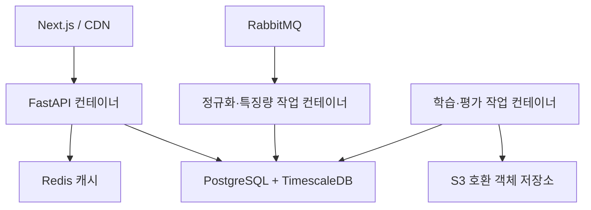

# 상용 전환 인프라와 실시간 서빙 전략

작성일: 2026-09-22

이 문서는 MVP 이후 운영 환경으로 확장할 때의 선택 기준을 정의한다. 현재 저장소에
클라우드 계정, 배포 리소스, 운영 비밀값을 추가하는 문서는 아니다.

## 1. 운영 전환 원칙

Kubernetes는 초기 MVP의 운영 범위에서 제외한다. 제품의 분석 수직 슬라이스와 데이터
이용권, 모델 성능, API 지연시간을 확인하기 전에 클러스터 운영을 도입하면 검증해야 할
변수가 늘어난다.

상용 트래픽이 발생하면 애플리케이션 컨테이너를 직접 관리하는 대신 관리형 컨테이너
서비스를 우선 검토한다.

| 상황 | 우선 검토 | 이유 |
|---|---|---|
| AWS의 S3·RDS·ElastiCache·ALB를 함께 사용할 때 | ECS on Fargate | 서버와 클러스터를 직접 관리하지 않고 ECS 서비스·ALB·CloudWatch에 연결할 수 있다. |
| GCP의 Cloud SQL·Memorystore·Load Balancing을 사용할 때 | Cloud Run | 요청 기반 자동 확장, 최소·최대 인스턴스, 동시 요청 수를 서비스 단위로 관리할 수 있다. |
| GPU·긴 작업·세밀한 네트워크 제어가 필요한 경우 | ECS Fargate 검토 후 별도 결정 | 서버리스 컨테이너의 제약과 작업 시간·비용을 먼저 측정한다. |
| 팀이 두 클라우드를 동시에 운영해야 할 때 | 초기에는 한 클라우드 선택 | 공통 Docker 이미지와 환경 변수 계약만 유지하고 배포 추상화는 뒤로 미룬다. |

AWS Fargate는 서버나 EC2 클러스터를 프로비저닝·확장하지 않고 ECS 작업을 실행한다.
ECS는 CloudWatch 지표를 기반으로 작업 수를 늘리고 줄일 수 있으며, 배포 회로 차단기와
rollback을 사용해 실패한 배포를 중단할 수 있다. Cloud Run도 최소·최대 인스턴스와
인스턴스당 최대 동시 요청 수, revision 단위의 점진 배포를 제공한다.

공식 참고:

- [AWS Fargate](https://docs.aws.amazon.com/AmazonECS/latest/developerguide/AWS_Fargate.html)
- [ECS Service Auto Scaling](https://docs.aws.amazon.com/AmazonECS/latest/developerguide/service-auto-scaling.html)
- [ECS Deployment Circuit Breaker](https://docs.aws.amazon.com/AmazonECS/latest/developerguide/deployment-circuit-breaker.html)
- [Cloud Run 점진 배포·rollback](https://docs.cloud.google.com/run/docs/rollouts-rollbacks-traffic-migration)
- [Cloud Run 최소 인스턴스](https://docs.cloud.google.com/run/docs/configuring/min-instances)
- [Cloud Run 최대 인스턴스](https://docs.cloud.google.com/run/docs/configuring/max-instances)
- [Cloud Run 동시 요청 수](https://docs.cloud.google.com/run/docs/about-concurrency)

## 2. 권장 운영 구성

첫 상용 후보는 역할별 컨테이너로 나눈다. 저장소를 여러 서비스로 분리하는 것이 아니라
하나의 모듈형 저장소에서 서로 다른 실행 명령을 배포한다.

- `FastAPI`: 짧은 요청·읽기 중심의 온라인 서빙. 학습과 원본 수집을 실행하지 않는다.
- 정규화·특징량 작업: RabbitMQ 재전달을 감당하는 멱등 소비자.
- 학습·평가 작업: 예약 또는 수동 실행. 모델 산출물을 객체 저장소에 기록한 뒤 등록부 상태를 바꾼다.
- PostgreSQL·TimescaleDB: 검증된 메타데이터, 특징량, 예측 결과의 기준 저장소다.

## 3. 무중단 배포 조건

1. 새 revision이 `/health/ready`에서 DB 읽기, Redis 연결, 모델 버전 로딩을 통과한다.
2. 기존 revision을 유지한 채 새 revision에 작은 트래픽을 보낸다.
3. 오류율, p95·p99 지연, 캐시 미적중률, DB 커넥션 사용량을 확인한다.
4. ECS는 deployment circuit breaker와 rollback을 켜고, Cloud Run은 revision 트래픽을 단계적으로 이동한다.
5. 새 모델 버전과 DB schema가 호환된 뒤 이전 revision을 내린다.

DB migration은 expand → backfill → switch → contract 순서를 사용한다.
새 컬럼·테이블을 먼저 추가하고 구버전과 신버전이 함께 읽을 수 있는 기간을 둔 뒤,
데이터를 채우고 읽기 경로를 전환한다. 이전 컬럼을 같은 배포에서 바로 삭제하지 않는다.

| 항목 | 시작점 | 조정 기준 |
|---|---:|---|
| API 최소 실행 단위 | 2개 컨테이너 또는 2개 인스턴스 | 가용성·비용 측정 후 조정 |
| API 최대 실행 단위 | 10개 | DB connection pool과 함께 부하 테스트 |
| 새 revision 초기 트래픽 | 5% | 통과하면 25%·50%·100% |
| 자동 rollback 조건 | 5분 오류율·p95 악화 | 실제 SLO와 부하 결과로 확정 |
| 작업 확장 지표 | queue backlog / 작업자 | CPU만으로 확장하지 않음 |

위 수치는 운영 확정값이 아니라 부하 테스트의 시작점이다.

## 4. SQL Snapshot과 Online Serving 분리

SQL Snapshot은 오프라인 학습과 결과 재현에 적합하다. 온라인 요청에서 원본 가격과
특징량을 매번 조인하고 모델을 다시 실행하면 트래픽 증가 시 지연이 커지고 요청마다
다른 기준시점이 사용될 위험이 있다.

온라인 경로는 요청에서 `asset`, `event`, `horizon`, `as_of`, `model_version`,
포트폴리오 해시를 정규화한 뒤, 승인된 예측 snapshot을 Redis에서 먼저 찾는다.
미적중이면 PostgreSQL의 이미 계산된 결과만 읽고, 검증을 통과한 결과를 짧은 TTL로 캐시한다.
데이터가 없거나 오래됐으면 숫자를 추정해서 채우지 않고 `pending`, `stale`,
`insufficient_data`, `unsupported` 중 하나로 응답한다.

권장 키 형식:

`analysis:v1:{asset_id}:{event_category}:{horizon}:{as_of_bucket}:{model_version}:{portfolio_hash}`

- `model_version`을 키에 포함해 새 모델이 이전 결과를 오염시키지 않게 한다.
- `as_of_bucket`은 기준시각을 일정한 구간으로 정규화한다.
- 개인 포트폴리오는 원본 비중 대신 정규화된 입력의 결정적 해시만 키에 사용한다.
- 이벤트 분석 결과는 분 단위 TTL을 시작점으로 두고 신선도·비용·지연을 함께 측정한다.

### 캐시 미적중 지연 방어

캐시 미적중은 모든 요청을 동시에 DB와 모델 계산으로 보내는 분기가 아니다.
같은 키에 요청이 몰리면 cache stampede가 발생하므로 다음 정책을 적용한다.

- **단일 비행(single flight)**: 키별 짧은 Redis lease를 획득한 요청만 DB를 조회하고, 나머지는 재조회하거나 stale 결과를 사용한다.
- **타임아웃 예산**: Redis, DB 쿼리, 계산, 직렬화에 각각 상한을 두고 전체 deadline 전에 상태 응답을 반환한다.
- **stale-while-revalidate**: 허용 가능한 오래된 결과를 먼저 반환하고 백그라운드에서 최신 snapshot을 캐시한다.
- **부하 격리**: 분석 API의 DB pool과 학습·정규화 작업의 pool을 분리한다.
- **쿼리 제한**: 온라인 경로에서 임의 날짜 범위 조인과 전체 포트폴리오 재계산을 허용하지 않는다.
- **실패 기준**: DB timeout, Redis 장애, 등록부 불일치는 예측값으로 대체하지 않는다.

## 5. 레이턴시·정확성 예산

초기 목표는 계약이 아니라 측정용 가설이다.

| 구간 | 시작 예산 | 측정 대상 |
|---|---:|---|
| 입력 검증·키 생성 | 20ms | Pydantic, 포트폴리오 해시 |
| Redis 조회 | 30ms | 네트워크·직렬화 포함 |
| PostgreSQL snapshot 조회 | 250ms | 인덱스·pool 대기·row 수 |
| 결과 검증·직렬화 | 100ms | 모델 버전·신뢰구간·상태 검사 |
| 전체 p95 | 500ms 이하 | 캐시 적중·미적중을 따로 측정 |

평균 지연만 기록하지 않고 p50, p95, p99와 timeout 비율을 기록한다.

## 6. 반드시 추가할 검증

- 같은 캐시 키의 동시 요청이 DB를 한 번만 조회하는지 확인
- 캐시 미적중 후 DB timeout 시 stale 결과와 `stale_at`을 반환하는지 확인
- stale 결과도 허용시간을 넘으면 `pending` 또는 `insufficient_data`가 되는지 확인
- 모델 버전·기준시점·포트폴리오가 다른 요청의 키가 충돌하지 않는지 확인
- Redis 장애가 원본 DB의 기준성을 바꾸지 않는지 확인
- 새 모델 승격 후 이전 캐시가 반환되지 않는지 확인
- PostgreSQL pool 고갈 시 학습 작업이 API 조회를 막지 않는지 확인
- 5% → 25% → 50% → 100% 배포 전환과 rollback을 시연
- queue backlog, API p95, DB connection, 캐시 적중률의 관계를 기록

## 7. 도입 순서

1. 로컬에서 FastAPI 계약과 snapshot 조회를 먼저 만든다.
2. Redis 없이 기준 p50·p95·p99를 측정한다.
3. cache-aside, 키 버전, single flight, stale 정책을 추가한다.
4. Redis 장애·DB timeout·동시 요청 테스트를 통과시킨다.
5. Docker로 동일 이미지를 만들고 managed container의 health/readiness 계약을 검증한다.
6. 선택한 클라우드 한 곳에 staging을 배포하고 작은 트래픽으로 점진 전환한다.
7. 실제 SLO와 비용을 확인한 뒤 autoscaling 범위와 TTL을 확정한다.

초기 추천은 AWS 데이터 계층을 선택하면 ECS/Fargate, GCP 데이터 계층을 선택하면
Cloud Run이다. 두 플랫폼을 동시에 운영하는 설계는 운영 지표와 비용이 확인된 뒤 검토한다.
