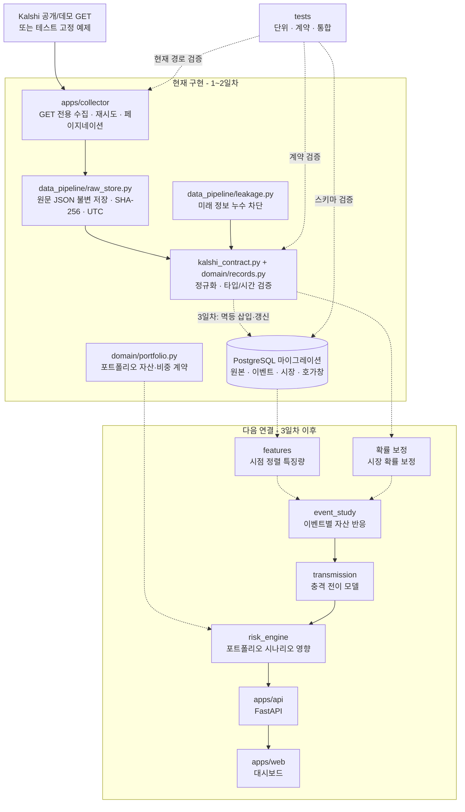

# 1~2일차 개발 리뷰

작성일: 2026-09-17

## 이번 요청에서 완료한 범위

### 1일차 - 저장소와 데이터 타당성

- 저장소와 분석 패키지 경계를 구성했다.
- Kalshi 공개/데모 및 과거 자료 API를 읽기 전용으로 검증했다.
- FOMC, CPI, 유가 계열의 독립 해결 이벤트 수를 집계했다.
- 계약 고정 예제, 확률 정규화, 응답 본문 SHA-256, 누수 방지 테스트를 추가했다.
- 데이터 사용권과 모델 표본 수에 대한 진행 가능·범위 축소·보류 판단을 문서화했다.

### 2일차 - 수집 계층과 원본 저장

- 이벤트, 시장 스냅샷, 호가창 스냅샷의 Pydantic 계약을 추가했다.
- 모든 저장 시각을 시각대가 지정된 UTC로 강제했다.
- PostgreSQL 최초 마이그레이션에 테이블, 제약조건, 인덱스, 원본 계보를 정의했다.
- Kalshi 운영·데모 허용 목록 기반 GET 전용 수집기를 추가했다.
- 429/일시적 5xx 횟수를 제한한 재시도와 커서 페이지네이션을 구현했다.
- 동일 요청 재실행 시 파일을 덮어쓰지 않는 불변 원본 저장소를 구현했다.

## 현재 코드 구조

```text
shockgraph-ai/
  apps/
    api/                         # 2주차 FastAPI 경계
    collector/
      shockgraph_collector/
        client.py                # GET 전용 클라이언트, 재시도, 페이지네이션, 원본 저장
    web/                         # 3주차 Next.js 경계
  packages/
    domain/shockgraph_domain/
      portfolio.py               # 포트폴리오 비중 계약
      records.py                 # 이벤트·시장·호가창 수집 계약
    data_pipeline/shockgraph_data_pipeline/
      kalshi_contract.py         # Kalshi 응답 정규화와 검증
      leakage.py                 # 이벤트 분할 및 미래 정보 누수 방지
      raw_store.py               # 내용 기반 불변 원본 저장소
    calibration/                 # 4일차 이후
    event_study/                 # 2주차
    transmission/                # 2주차
    risk_engine/                 # 2주차
  infra/postgres/migrations/
    0001_ingestion.sql           # 원본·이벤트·시장·호가창 스키마
  data/fixtures/kalshi/          # 테스트용 축약 API 응답
  docs/
    data-feasibility.md          # 실데이터·표본·라이선스 판단
    dependencies.md              # 의존성 도입 근거
    reviews/day-01-02-review.md  # 현재 검토 문서
  scripts/probe_kalshi.py        # 공개 API 가용성 재검증
  tests/                         # 단위·계약·통합·전체 흐름·기준 정답 테스트
```

## 데이터 흐름

```text
Kalshi 공개 GET
  -> 횟수를 제한한 재시도 / 커서 페이지네이션
  -> UTC 관측시각
  -> 불변 원본 JSON + SHA-256
  -> Pydantic 수집 계약
  -> PostgreSQL 정제 테이블 (3일차 연결 예정)
```

주문, 계좌, 인증키, 매수/매도 추천 경로는 존재하지 않는다.

## 구조 도식



- 실선은 현재 코드에서 실제로 동작하거나 같은 계층 안에서 연결된 경로다.
- 점선은 계약/스키마만 준비됐거나 다음 개발 일차에 연결할 경로다.
- 현재 핵심은 `수집 -> 원본 보존 -> 검증`이며, 예측 모델과 UI는 아직 구현 전이다.

## 목표 아키텍처 개정

2026-09-19에 목표 구조를 원본 우선 저장 비동기 파이프라인으로 개정했다. 이 변경은
기획 변경이며 아래 구성요소가 현재 구현됐다는 의미는 아니다. 상세 처리 계약과
점검 항목은 [architecture.md](../architecture.md)를 따른다.

```text
외부 API
  -> 수집기
  -> 불변 S3/MinIO 객체
  -> PostgreSQL 메타데이터 + 트랜잭션 아웃박스
  -> RabbitMQ
  -> 멱등 정규화 작업 프로세스
  -> PostgreSQL + TimescaleDB 특징량 스냅샷
  -> Prefect가 제어하는 모델 학습
  -> 모델 등록부 + 예측 DB
  -> Redis 캐시
  -> FastAPI
  -> Next.js
```

MVP는 Kafka, Kubernetes, 독립 마이크로서비스를 도입하지 않는다. RabbitMQ,
MinIO, Prefect, Redis는 각 선행 데이터 계약과 성능 기준을 통과한 뒤 단계적으로
도입한다.

### 2026-09-19 기획 변경 검증

- 변경 범위: 기획, 아키텍처, 데이터 계보, 의존성 결정 문서만 수정
- `git diff --check`: 통과
- `ruff check`: 통과
- `pytest`: 26개 통과
- `compileall`: 통과
- Pyright: 기존과 동일하게 Codex 샌드박스가 `C:\Users\agy91`의 `lstat`을
  `EPERM`으로 차단해 실행되지 않음
- 신규 실행 의존성 또는 Docker 서비스: 추가하지 않음

## 검증 결과

- `pytest`: 26개 통과
- `ruff check`: 통과
- `compileall`: 통과
- 비밀키 및 주문 API 문자열 검사: 검출 없음
- Pyright: 설정은 존재하지만 Codex 샌드박스에서 Node가 사용자 상위 경로를
  `lstat`하는 단계가 `EPERM`으로 차단된다. 일반 로컬 환경에서는
  `.venv/Scripts/python -m pyright`로 재확인해야 한다.

## 직접 점검해야 할 부분

- [ ] `docs/data-feasibility.md`의 Kalshi 라이선스 보류 판단에 동의하는가?
- [ ] MVP 대표 이벤트를 `KXFEDDECISION`, `KXCPI` 두 계열로 고정해도 되는가?
- [ ] 유가는 작은 Kalshi 표본을 유지할지, 별도 라이선스 데이터로 교체할지 결정했는가?
- [ ] 원본 데이터 보관 위치와 보존기간을 로컬 연구용 기준으로 정했는가?
- [ ] `0001_ingestion.sql`의 가격 정밀도 `NUMERIC(8, 6)`이 필요한 세밀도를 만족하는가?
- [ ] 공개 시연에서는 실제 Kalshi 원천값 대신 고정 예제·합성값을 사용한다는 데 동의하는가?
- [ ] 다음 자산 공급원 2차 검토에서 사용할 미국 및 한국 자산 가격 공급원을 정했는가?

## 알려진 제한

- PostgreSQL 마이그레이션은 정의됐지만 DB 저장기와 실제 삽입·갱신은 3일차 범위다.
- 수집기는 원본을 안전하게 저장하지만 정제 데이터·특징량 변환은 아직 연결하지 않았다.
- 미국 ETF, USD/KRW, 국내 ETF 가격 수집과 거래일 정렬은 아직 구현하지 않았다.
- 공개 배포는 Kalshi 서면 허가 또는 대체 라이선스 확보 전까지 진행하지 않는다.
- UI와 모델 학습은 아직 시작하지 않았다.

## 다음 요청 범위: 3~4일차

### 3일차

- 미국 ETF 및 환율/한국 자산 데이터 공급원 2차 검토 확정
- 객체 저장소, 큐 발행기, 저장소 프로토콜과 자산 가격 계약
- UTC, 미국/한국 거래일, 휴장일 정렬 테스트
- PostgreSQL/TimescaleDB 자산 가격, 특징량 스냅샷, 아웃박스 스키마
- 원본 → 정제 데이터 멱등 삽입·갱신 경로

### 4일차

- 확률 보정 데이터셋 생성
- 이벤트 단위 시간순 분할
- 관측시각/해결시각/특징량 시각 누수 테스트 확대
- 시장확률 기준 모델과 Brier 점수 계산
- 모델 산출물 URI, 체크섬, 버전, 지표 등록부 계약
