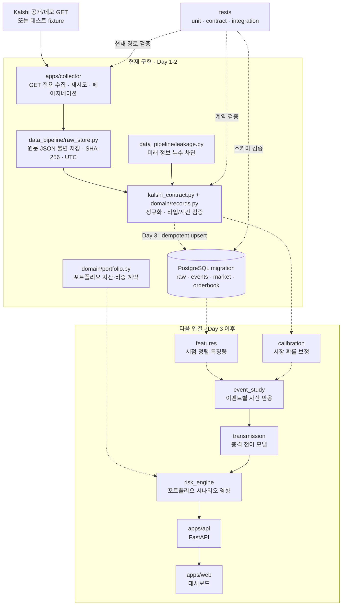

# Day 01-02 개발 리뷰

작성일: 2026-09-17

## 이번 요청에서 완료한 범위

### Day 1 - 저장소와 데이터 타당성

- 저장소와 분석 패키지 경계를 구성했다.
- Kalshi 공개/데모 및 historical API를 읽기 전용으로 검증했다.
- FOMC, CPI, 유가 계열의 독립 해결 이벤트 수를 집계했다.
- 계약 fixture, 확률 정규화, payload SHA-256, 누수 방지 테스트를 추가했다.
- 데이터 사용권과 모델 표본 수에 대한 GO/REDUCE_SCOPE/BLOCKED 판단을 문서화했다.

### Day 2 - 수집 계층과 원본 저장

- 이벤트, 시장 snapshot, order-book snapshot의 Pydantic 계약을 추가했다.
- 모든 저장 시각을 timezone-aware UTC로 강제했다.
- PostgreSQL 최초 migration에 테이블, 제약조건, 인덱스, raw lineage를 정의했다.
- Kalshi production/demo allowlist 기반 GET-only collector를 추가했다.
- 429/일시적 5xx bounded retry와 cursor pagination을 구현했다.
- 동일 요청 재실행 시 파일을 덮어쓰지 않는 immutable raw store를 구현했다.

## 현재 코드 구조

```text
shockgraph-ai/
  apps/
    api/                         # Week 2 FastAPI 경계
    collector/
      shockgraph_collector/
        client.py                # GET-only client, retry, pagination, raw 저장
    web/                         # Week 3 Next.js 경계
  packages/
    domain/shockgraph_domain/
      portfolio.py               # 포트폴리오 비중 계약
      records.py                 # 이벤트/시장/order-book ingestion 계약
    data_pipeline/shockgraph_data_pipeline/
      kalshi_contract.py         # Kalshi payload 정규화와 검증
      leakage.py                 # event split 및 미래정보 누수 방지
      raw_store.py               # content-addressed immutable raw 저장소
    calibration/                 # Day 4 이후
    event_study/                 # Week 2
    transmission/                # Week 2
    risk_engine/                 # Week 2
  infra/postgres/migrations/
    0001_ingestion.sql           # raw/events/market/orderbook schema
  data/fixtures/kalshi/          # 테스트용 축약 API 응답
  docs/
    data-feasibility.md          # 실데이터·표본·라이선스 판단
    dependencies.md              # 의존성 도입 근거
    reviews/day-01-02-review.md  # 현재 검토 문서
  scripts/probe_kalshi.py        # 공개 API 가용성 재검증
  tests/                         # unit/contracts/integration/e2e/golden
```

## 데이터 흐름

```text
Kalshi public GET
  -> bounded retry / cursor pagination
  -> UTC observation timestamp
  -> immutable raw JSON + SHA-256
  -> Pydantic ingestion contract
  -> PostgreSQL clean tables (Day 3 연결 예정)
```

주문, 계좌, 인증키, 매수/매도 추천 경로는 존재하지 않는다.

## 구조 도식



- 실선은 현재 코드에서 실제로 동작하거나 같은 계층 안에서 연결된 경로다.
- 점선은 계약/스키마만 준비됐거나 다음 개발 일차에 연결할 경로다.
- 현재 핵심은 `수집 -> 원본 보존 -> 검증`이며, 예측 모델과 UI는 아직 구현 전이다.

## 검증 결과

- `pytest`: 26 passed
- `ruff check`: 통과
- `compileall`: 통과
- 비밀키 및 주문 API 문자열 검사: 검출 없음
- Pyright: 설정은 존재하지만 Codex 샌드박스에서 Node가 사용자 상위 경로를
  `lstat`하는 단계가 `EPERM`으로 차단된다. 일반 로컬 환경에서는
  `.venv/Scripts/python -m pyright`로 재확인해야 한다.

## 직접 점검해야 할 부분

- [ ] `docs/data-feasibility.md`의 Kalshi 라이선스 BLOCKED 판단에 동의하는가?
- [ ] MVP 대표 이벤트를 `KXFEDDECISION`, `KXCPI` 두 계열로 고정해도 되는가?
- [ ] 유가는 작은 Kalshi 표본을 유지할지, 별도 라이선스 데이터로 교체할지 결정했는가?
- [ ] raw 데이터 보관 위치와 보존기간을 로컬 연구용 기준으로 정했는가?
- [ ] `0001_ingestion.sql`의 가격 정밀도 `NUMERIC(8, 6)`이 필요한 세밀도를 만족하는가?
- [ ] 공개 시연에서는 실제 Kalshi 원천값 대신 fixture/합성값을 사용한다는 데 동의하는가?
- [ ] 다음 Gate B에서 사용할 미국 및 한국 자산 가격 공급원을 정했는가?

## 알려진 제한

- PostgreSQL migration은 정의됐지만 DB writer와 실제 upsert는 Day 3 범위다.
- collector는 원본을 안전하게 저장하지만 clean/feature 변환은 아직 연결하지 않았다.
- 미국 ETF, USD/KRW, 국내 ETF 가격 수집과 거래일 정렬은 아직 구현하지 않았다.
- 공개 배포는 Kalshi 서면 허가 또는 대체 라이선스 확보 전까지 진행하지 않는다.
- UI와 모델 학습은 아직 시작하지 않았다.

## 다음 요청 범위: Day 03-04

### Day 3

- 미국 ETF 및 환율/한국 자산 데이터 공급원 Gate B 확정
- 자산 가격 collector와 데이터 계약
- UTC, 미국/한국 거래일, 휴장일 정렬 테스트
- raw -> clean idempotent upsert 경로

### Day 4

- calibration dataset 생성
- event-level chronological split
- 관측시각/해결시각/feature timestamp 누수 테스트 확대
- 시장확률 baseline과 Brier Score 계산
