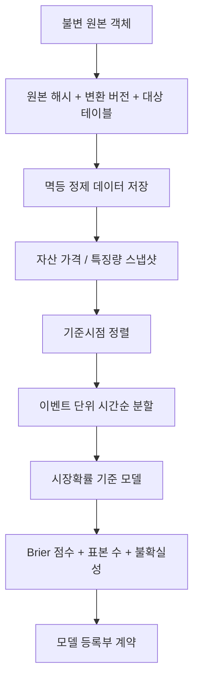

# 3~4일차 개발 리뷰

작성일: 2026-09-22

## 완료 범위

### 3일차 - 저장 경계와 원본 정규화 경로

- `ObjectStore`, `QueuePublisher`, `CleanRepository` 프로토콜을 정의했다.
- 로컬 파일 시스템에서도 S3 형식 URI와 분할 경로의 객체 키를 유지하는
  `LocalObjectStore`를 구현했다.
- 같은 키에 다른 바이트를 덮어쓰지 않는 불변성·충돌 검사를 추가했다.
- `payload_hash + transformation_version + target_table` 기반 멱등 키와
  `RawToCleanWriter`를 구현했다.
- 미국·한국 거래소 시각대의 거래일 변환, 주말/주입형 휴장일 검사,
  `feature_as_of` 이전 최신값 선택을 구현했다.
- TimescaleDB용 자산 가격/특징량 스냅샷, 정규화 실행 기록, 트랜잭션 아웃박스
  스키마를 추가했다.
- 자산 공급원 2차 검토는 FRED 진행 가능, 미국 ETF 범위 축소, KRX 보류로 결정했다.

### 4일차 - 확률 보정 기준 모델과 등록부

- UTC와 `feature_as_of <= observed_at < resolved_at`를 강제하는 확률 보정 행을
  구현했다.
- 동일 이벤트의 결과와 해결시각 일관성을 검증한다.
- 동일 `event_id`가 분할을 넘지 않는 이벤트 단위 시간순 분할을 구현했다.
- Kalshi 관측확률을 그대로 반환하는 시장확률 기준 모델을 구현했다.
- Brier 점수와 표본 수, 표준오차, 95% 정규근사 신뢰구간을 함께 계산한다.
- 모델 산출물 URI·체크섬, 데이터셋 체크섬, 버전, 상태, 지표 계약과 PostgreSQL
  등록부 스키마를 추가했다.

## 변경 코드 구조

```text
packages/
  calibration/shockgraph_calibration/
    dataset.py                    # 누수 차단 데이터셋 + 이벤트 단위 시간순 분할
    metrics.py                    # 시장확률 기준 모델 + Brier 점수·불확실성
  data_pipeline/shockgraph_data_pipeline/
    ports.py                      # 객체 저장소·큐 발행기·저장소 프로토콜
    object_store.py               # S3 호환 키 + 불변 로컬 어댑터
    normalization.py              # 원본 정규화 멱등 저장기
    trading_time.py               # 미국·한국 거래일 및 기준시점 정렬
  domain/shockgraph_domain/
    records.py                    # 자산 가격·특징량 스냅샷 계약
    model_registry.py             # 산출물·버전·평가 지표 계약
infra/postgres/migrations/
  0002_day03_04.sql               # 시계열·아웃박스·정규화·모델 등록부
docs/
  data-source-gate-b.md           # 공급원 판정과 어댑터 도입 조건
tests/
  contracts/test_day03_04_schema.py
  unit/test_calibration_baseline.py
  unit/test_model_registry.py
  unit/test_normalization.py
  unit/test_object_store.py
  unit/test_trading_time.py
```

## 핵심 처리 흐름



## 검증 결과

- `make PYTHON=.venv/bin/python quality`
  - Ruff: 통과
  - Pyright: `0 errors, 0 warnings`
- `make PYTHON=.venv/bin/python test`
  - `42 passed`
- 회귀 테스트로 확인한 금융 시점 오류:
  - 한국 장의 거래일은 UTC 달력 날짜보다 하루 뒤일 수 있으며 정상 허용한다.
  - 기준시점 선택기는 기준시각 이후의 가격을 선택하지 않는다.
  - 동일 이벤트는 학습·검증·시험에 중복되지 않는다.

## 직접 점검할 항목

- [ ] 로컬 객체 저장 버킷 이름 `shockgraph-local`을 유지할지 정했는가?
- [ ] FRED API 키를 `.env`가 아닌 실행환경 비밀값으로 주입할 것인가?
- [ ] 미국 ETF 공급 계약을 확정하기 전 고정 예제만 공개한다는 범위에 동의하는가?
- [ ] KRX Open API 이용계약 확인 전 한국 자산 수집기를 보류하는가?
- [ ] 거래소 휴장일을 별도 승인된 거래일 달력 어댑터로 공급할 것인가?
- [ ] Brier 신뢰구간을 다음 단계에서 이벤트 단위 군집 재표집으로 고도화할 것인가?
- [ ] TimescaleDB 마이그레이션을 실제 컨테이너에 적용하기 전 백업·되돌리기 절차를 추가할 것인가?

## 알려진 제한

- MinIO와 RabbitMQ 서비스 및 PostgreSQL 어댑터는 아직 연결하지 않았다.
- 마이그레이션은 계약 테스트로 검증했으며 실제 TimescaleDB 인스턴스에는 적용하지 않았다.
- 휴장일은 현재 호출자가 주입한다. 거래소 공식 거래일 달력 자동 갱신은 후속 범위다.
- Brier 신뢰구간은 관측 행의 독립성을 가정한 기술 통계다. 같은 이벤트 내 반복 관측을
  고려하는 군집 재표집은 실제 표본 확보 후 추가한다.
- 공급원 라이선스가 확정되지 않아 자산 가격 원천값은 저장소에 포함하지 않았다.

## 다음 권장 범위: 5~6일차

- MinIO 어댑터와 PostgreSQL 저장소 통합 테스트
- 아웃박스 발행기와 RabbitMQ 재전달·멱등성 테스트
- 승인된 공급원 고정 예제의 자산 가격 정규화기
- 이벤트 단위 군집 재표집 Brier 신뢰구간
- 로지스틱·등장 회귀 확률 보정 후보와 시장확률 기준 모델 비교

## 2026-09-22 학습·제품 설계 보완

- [학습 가이드](../study-guide-day-03-04.md): 6회 학습 순서, 코드별 실습,
  Brier 손계산, 이벤트 확률과 자산 반응의 연결, 현재 구현 한계.
- [화면 설계](../product-ui-direction.md): 지원 조합 안의 사용자 선택,
  Chakra UI v3 카드/토큰 방향, 모바일 흐름, 결과 표시 계약, 유입 가설 검증.
- README, 프로젝트 명세, 웹 README에서 위 문서를 연결했다.
- 보완 범위는 문서와 대화 내 화면 예시이며, 5~6일차 기능 구현은 수행하지 않았다.
- 재검증: `make PYTHON=.venv/bin/python quality` 통과, Pyright 오류 0개,
  `make PYTHON=.venv/bin/python test` 42개 통과, `git diff --check` 통과.

## 문서 한글화와 커밋 규칙 보완

- 저장소의 Markdown 문서 27개를 한글로 정리했다. 코드 식별자, 명령어, 경로, URL은 유지했다.
- `AGENTS.md`에 한글 문서 작성과 주요 변경 내용 중심의 한글 커밋 제목 규칙을 추가했다.
- 리뷰 파일의 일차 표기는 일정 추적용으로 유지한다.
- 기존 기능 구현과 문서 정리를 각각 별도 로컬 커밋으로 나눈다.
- 검증: 문서 상대 링크 확인, `git diff --check`, Ruff, Pyright 통과 및 테스트 42개 통과.
