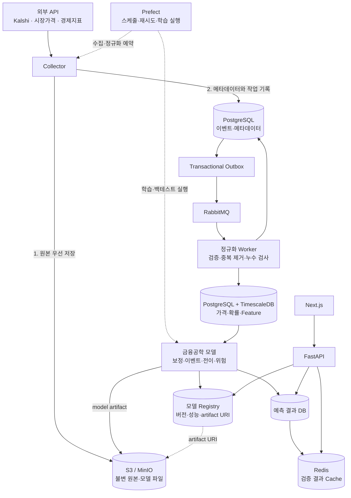

# ShockGraph AI Project Specification

상태: 2026-09-19 목표 아키텍처 개정

이 문서는 저장소의 최상위 기획 계약이다. 구현 상세와 단계별 도입 기준은
[architecture.md](docs/architecture.md), 금융 방법론은
[methodology.md](docs/methodology.md), 각 개발 요청의 검증 결과는
`docs/reviews/`에서 관리한다.

## 1. 제품 목표

ShockGraph AI는 CPI, FOMC, 유가 등 거시 이벤트의 시장확률과 실제 발표값을
자산 가격 반응에 연결해 다음 결과를 제공하는 연구·위험분석 시스템이다.

- 이벤트 시나리오별 자산 상승확률과 기대수익률
- 기간별 수익률 분포와 신뢰구간
- 이벤트 충격의 자산 간 지연 전이
- 사용자 포트폴리오의 예상 손익, VaR, Expected Shortfall, 위험 기여도
- 모델 버전, 표본 수, 성능지표, 한계가 포함된 설명 가능한 결과

매수·매도 주문, 자동매매, 개인화 투자 권유는 범위에 포함하지 않는다.

## 2. 핵심 데이터

- Kalshi 공개/데모 API: CPI·FOMC 등 이벤트 계약의 시장확률
- 공식 경제 데이터: CPI, 기준금리, 고용 등 실제 발표값과 발표시각
- 라이선스가 명확한 시장 데이터 API: ETF, 채권, 환율, 원자재, 국내 자산 가격
- 사용자 입력: 종목 식별자와 포트폴리오 비중

Kalshi 확률은 자산 상승확률 그 자체가 아니라 모델 입력이다. 최종 자산
상승확률은 보정된 이벤트 시나리오 확률과 시나리오 조건부 자산 반응을 결합해
계산한다.

## 3. 목표 아키텍처

## 4. 처리 계약

### 수집

1. Collector가 외부 API 응답을 가져온다.
2. 원본 payload를 먼저 불변 Object Store에 저장하고 SHA-256을 계산한다.
3. PostgreSQL 트랜잭션에서 원본 메타데이터와 outbox 작업을 함께 기록한다.
4. Outbox relay가 RabbitMQ에 메시지를 발행한다.
5. Worker는 `payload_hash + transformation_version`을 멱등 키로 정규화한다.

메시지는 중복 전달될 수 있다고 가정한다. RabbitMQ가 없어도 동일한 Worker를
동기 호출할 수 있어야 하며 단위 테스트는 broker에 의존하지 않는다.

### 저장

- Object Store: 원본 JSON, 학습 데이터 snapshot, 모델 binary, 보고서
- PostgreSQL 일반 테이블: 이벤트, 자산, 수집 작업, 모델 버전, 성능지표
- TimescaleDB hypertable: 시장확률, 자산 가격, 특징량, 예측 시계열
- Redis: 최신 검증 결과의 TTL cache만 담당하며 원본 데이터는 저장하지 않는다.

### 학습

1. Prefect가 dataset build, 학습, 평가 작업을 예약한다.
2. Dataset builder는 `feature_as_of` 이전에 관측된 정보만 조회한다.
3. 동일한 `event_id`는 하나의 train/validation/test split에만 속한다.
4. 보정 모델은 시장확률 identity baseline과 반드시 비교한다.
5. 통과한 모델 파일은 Object Store, 버전·지표는 Registry 테이블에 기록한다.

### 서빙

1. Next.js는 PostgreSQL이나 Redis에 직접 연결하지 않고 FastAPI만 호출한다.
2. FastAPI는 Redis cache를 먼저 확인하고 miss이면 검증된 prediction DB를 읽는다.
3. 사용자 포트폴리오 계산은 승인된 모델 버전과 특징량 snapshot을 사용한다.
4. API 응답에는 모델 버전, 기준시각, 표본 수, 신뢰구간, 제한사항을 포함한다.

## 5. 모델 계층

- Probability calibration: Kalshi 원시 확률을 실제 발생빈도에 맞게 보정
- Event study: 이벤트 전후 abnormal return, CAR, CAAR와 불확실성 추정
- Transmission: 금리·채권·환율·주식 간 지연 연관성 추정
- Risk engine: 시나리오 수익률을 포트폴리오 비중과 결합

Brier score를 확률 보정의 1차 지표로 사용하며 log loss와 calibration error를
함께 보고한다. 지연 연관성을 인과효과로 표현하지 않는다.

## 6. 단계적 도입

### 완료: Day 1-2

- Kalshi GET-only collector와 fixture
- 불변 로컬 Raw Store와 payload hash
- UTC/Pydantic ingestion 계약과 누수 방지
- PostgreSQL 최초 ingestion schema

### 다음 구현: Day 3-4

- Object Store, Queue Publisher, Repository protocol 정의
- 로컬 파일 구현을 유지하며 S3-compatible object key 계약 추가
- PostgreSQL/TimescaleDB용 asset price, feature snapshot, outbox schema
- raw-to-clean idempotent writer와 거래일·시점 정렬 테스트
- calibration dataset과 시장확률 identity baseline
- 모델 artifact/registry 계약과 Brier Score

### 후속 구현

- MinIO와 RabbitMQ 실행 환경 및 outbox relay
- Prefect 수집·학습 flow
- 이벤트 스터디, 전이 모델, 포트폴리오 위험 엔진
- FastAPI와 검증된 prediction endpoint
- 부하 측정 후 Redis cache
- 분석 수직 슬라이스 검증 후 Next.js 대시보드

## 7. 제외 범위

- Kafka, Kubernetes, 서비스별 독립 저장소를 가진 마이크로서비스 분리
- GNN, LSTM, Transformer 기반 가격예측을 MVP 근거 없이 도입
- 주문·계좌·체결·인증키 처리
- 인증, 결제, 다중 사용자 운영 기능
- 라이선스 승인 전 원천 데이터의 공개 재배포

## 8. 품질 기준

- 모든 저장 시각은 UTC이고 원본 hash와 transformation version을 추적한다.
- 모델 결과에는 표본 수와 불확실성을 포함한다.
- 현재 구현과 목표 구조를 문서에서 명확히 구분한다.
- 모든 2일 개발 묶음은 테스트 결과와 사용자 점검표를 review MD에 남긴다.
