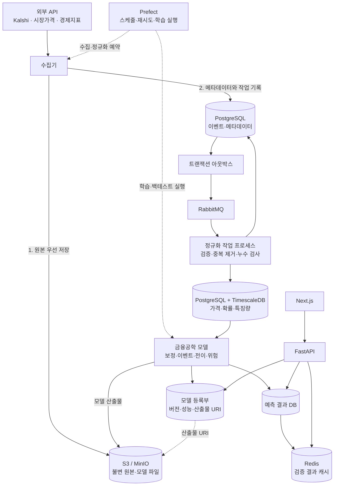

# ShockGraph AI 프로젝트 명세

상태: 2026-09-19 목표 아키텍처 개정

이 문서는 저장소의 최상위 기획 계약이다. 구현 상세와 단계별 도입 기준은
[architecture.md](docs/architecture.md), 금융 방법론은
[methodology.md](docs/methodology.md), 각 개발 요청의 검증 결과는
`docs/reviews/`에서 관리한다.

학습 자료는 [3~4일차 학습 가이드](docs/study-guide-day-03-04.md),
사용자 선택과 Chakra UI 화면 방향은 [제품·화면 설계](docs/product-ui-direction.md)를 따른다.
상용 전환과 온라인 서빙 지연 기준은 [상용 전환 인프라와 실시간 서빙 전략](docs/deployment-and-serving-strategy.md),
데이터 정의와 평가 방법은 [데이터 분석 방법론](docs/methodology.md)을 따른다.
공모전·금융 리서치 관점의 현재 수준과 검증 우선순위는
[분석 가치 재평가](docs/research-value-assessment.md)를 따른다.

## 1. 제품 목표

ShockGraph AI는 CPI, FOMC, 유가 등 거시 이벤트의 시장확률과 실제 발표값을
자산 가격 반응에 연결해 다음 결과를 제공하는 연구·위험분석 시스템이다.

- 이벤트 시나리오별 자산 상승확률과 기대수익률
- 기간별 수익률 분포와 신뢰구간
- 이벤트 충격의 자산 간 지연 전이
- 사용자 포트폴리오의 예상 손익, VaR, 기대손실(Expected Shortfall), 위험 기여도
- 모델 버전, 표본 수, 성능지표, 한계가 포함된 설명 가능한 결과

매수·매도 주문, 자동매매, 개인화 투자 권유는 범위에 포함하지 않는다.

## 2. 핵심 데이터

- Kalshi 공개/데모 API: CPI·FOMC 등 이벤트 계약의 시장확률
- 공식 경제 데이터: CPI, 기준금리, 고용 등 실제 발표값과 발표시각
- 라이선스가 명확한 시장 데이터 API: ETF, 채권, 환율, 원자재, 국내 자산 가격
- 사용자 입력: 종목 식별자와 포트폴리오 비중

Kalshi 확률은 자산 상승확률 그 자체가 아니라 모델 입력이다. 최종 자산
상승확률은 보정된 이벤트 시나리오 확률과 시나리오 조건부 자산 반응을 결합해
계산한다.

## 3. 목표 아키텍처

## 4. 처리 계약

### 수집

1. 수집기가 외부 API 응답을 가져온다.
2. 원본 응답 본문을 먼저 불변 객체 저장소에 저장하고 SHA-256을 계산한다.
3. PostgreSQL 트랜잭션에서 원본 메타데이터와 아웃박스 작업을 함께 기록한다.
4. 아웃박스 발행기가 RabbitMQ에 메시지를 발행한다.
5. 작업 프로세스는 `payload_hash + transformation_version`을 멱등 키로 정규화한다.

메시지는 중복 전달될 수 있다고 가정한다. RabbitMQ가 없어도 동일한 작업 프로세스를
동기 호출할 수 있어야 하며 단위 테스트는 브로커에 의존하지 않는다.

### 저장

- 객체 저장소: 원본 JSON, 학습 데이터 스냅샷, 모델 바이너리, 보고서
- PostgreSQL 일반 테이블: 이벤트, 자산, 수집 작업, 모델 버전, 성능지표
- TimescaleDB 하이퍼테이블: 시장확률, 자산 가격, 특징량, 예측 시계열
- Redis: 최신 검증 결과의 TTL 캐시만 담당하며 원본 데이터는 저장하지 않는다.

### 학습

1. Prefect가 데이터셋 생성, 학습, 평가 작업을 예약한다.
2. 데이터셋 생성기는 `feature_as_of` 이전에 관측된 정보만 조회한다.
3. 동일한 `event_id`는 하나의 학습·검증·시험 분할에만 속한다.
4. 보정 모델은 시장확률 기준 모델과 반드시 비교한다.
5. 통과한 모델 파일은 객체 저장소, 버전·지표는 등록부 테이블에 기록한다.

### 서빙

1. Next.js는 PostgreSQL이나 Redis에 직접 연결하지 않고 FastAPI만 호출한다.
2. FastAPI는 Redis 캐시를 먼저 확인하고 없으면 검증된 예측 DB를 읽는다.
3. 사용자 포트폴리오 계산은 승인된 모델 버전과 특징량 스냅샷을 사용한다.
4. API 응답에는 모델 버전, 기준시각, 표본 수, 신뢰구간, 제한사항을 포함한다.

## 5. 모델 계층

- 확률 보정: Kalshi 원시 확률을 실제 발생빈도에 맞게 보정
- 이벤트 연구: 이벤트 전후 비정상수익률, CAR, CAAR와 불확실성 추정
- 전이 분석: 금리·채권·환율·주식 간 지연 연관성 추정
- 위험 계산: 시나리오 수익률을 포트폴리오 비중과 결합

Brier 점수를 확률 보정의 1차 지표로 사용하며 로그 손실과 확률 보정 오차를
함께 보고한다. 지연 연관성을 인과효과로 표현하지 않는다.

## 6. 단계적 도입

### 완료: 1~2일차

- Kalshi GET 전용 수집기와 고정 예제
- 불변 로컬 원본 저장소와 응답 본문 해시
- UTC/Pydantic 수집 계약과 누수 방지
- PostgreSQL 최초 수집 스키마

### 완료: 3~4일차

- 객체 저장소, 큐 발행기, 저장소 프로토콜 정의
- 로컬 파일 구현을 유지하며 S3 호환 객체 키 계약 추가
- PostgreSQL/TimescaleDB용 자산 가격, 특징량 스냅샷, 아웃박스 스키마
- 원본 정규화 멱등 저장기와 거래일·시점 정렬 테스트
- 확률 보정 데이터셋과 시장확률 기준 모델
- 모델 산출물·등록부 계약과 Brier 점수

### 완료: 5~6일차 분석 기반

- 발표 전 입력·정답 이용 가능 시각·자산 가격의 정규화 계약
- 이벤트별 사용 가능·누락·시간 누수 상태 기록
- 과거 수익률 분포와 고정 임계값 확률 가중 분포의 순차 비교
- 자산·포트폴리오 CRPS와 발표 단위 대응 재표집
- 체크섬 기반 리포트와 합성 예제 CLI

실데이터 접근·가격 연결은 아직 완료하지 않았으며 검증 결과는
[분석 개발 리뷰](docs/reviews/day-05-06-review.md)를 따른다.
확률 가중 경험적 기준선을 실제 surprise 회귀나 학습 완료 모델로 표현하지 않는다.

### 후속 구현

- MinIO와 RabbitMQ 실행 환경 및 아웃박스 발행기
- Prefect 수집·학습 흐름
- 이벤트 스터디, 전이 모델, 포트폴리오 위험 엔진
- FastAPI와 검증된 예측 엔드포인트
- 부하 측정 후 Redis 캐시
- 분석 수직 슬라이스 검증 후 Next.js 대시보드
- 상용 전환 시 관리형 컨테이너(ECS/Fargate 또는 Cloud Run) 선택과 무중단 배포 검증
- Redis 지연 로딩 캐시, 단일 비행, 오래된 응답, DB timeout의 온라인 지연 테스트

## 7. 제외 범위

- Kafka, Kubernetes, 서비스별 독립 저장소를 가진 마이크로서비스 분리
- GNN, LSTM, Transformer 기반 가격예측을 MVP 근거 없이 도입
- 주문·계좌·체결·인증키 처리
- 인증, 결제, 다중 사용자 운영 기능
- 라이선스 승인 전 원천 데이터의 공개 재배포
- Kubernetes 클러스터 운영을 MVP의 필수 구성으로 포함하지 않음

## 8. 품질 기준

- 모든 저장 시각은 UTC이고 원본 해시와 변환 버전을 추적한다.
- 모델 결과에는 표본 수와 불확실성을 포함한다.
- 현재 구현과 목표 구조를 문서에서 명확히 구분한다.
- 모든 2일 개발 묶음은 테스트 결과와 사용자 점검표를 리뷰 문서에 남긴다.

## 9. 사용자 선택과 화면 방향 (2026-09-22 보완)

- 분석을 지원하는 자산·이벤트·기간 조합 안에서 사용자가 선택한다.
- `configs/assets.yaml`은 후보 대상 자산 집합이며 학습 완료 또는 서빙 가능 목록이 아니다.
- 이벤트 발생확률, 자산 상승확률, 기대수익률을 구별해 표시한다.
- 데이터·모델 근거가 부족한 조합에는 지원 상태와 이유를 표시한다.
- Next.js와 Chakra UI v3 기반의 모바일 중심 카드 화면을 목표로 한다.
- 첫 체험은 로그인 없이 제공하며, 종목 선택 → 사건 영향 → 근거 확인을 핵심 흐름으로 둔다.
- 현재 UI와 자산 반응 예측은 구현 전이다. 이번 보완은 다음 개발 일차를 진행한 것이 아니다.
